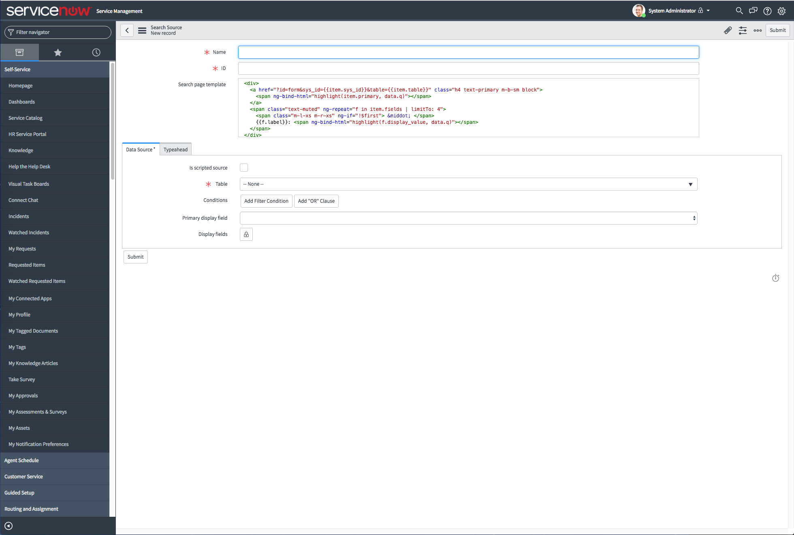
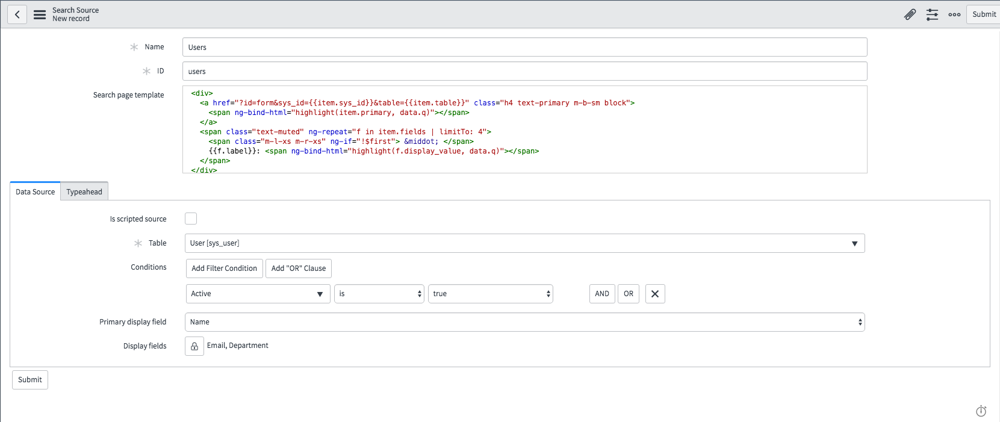
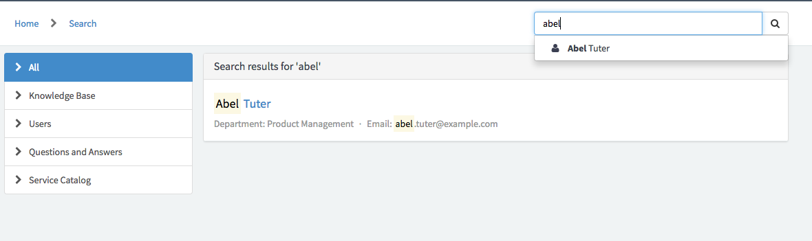

# Search in Istanbul

In Istanbul, we are introducing a large update of how the default search widgets work in Istanbul. Here, you will find documentation on what has changed, and how you can leverage the new features to improve the Service Portal search experience.

___
## High Level Overview
Following is an overview of the new concepts you will need to know to work with search.

### Search Sources
A **search source** is a record that describes the behavior and source of some type of data that you would like to search over. The search group defines where search data is retrieved from, how a search entry is templated in the search result page, and whether or not typeahead functionality is enabled for that search type.

#### Choosing What Data to Search
The data for Search Sources can be generated one of two ways (completely configurable):
  1. **Simple:** Search Sources can be defined as a table within ServiceNow. When using this method of defining a search source, the administrator can define what field on the table to use as a primary field, what field to search over, and what additional fields to display. This method does not involve writing any code.
  2. **Advanced:** For more control over how a search is executed and what data is searched and returned, administrators can define a **data-fetching script** which executes on the server and builds up a result array to return to the search widget. This method is more complex, but offers complete power over how a search is executed. Here, you are not limited to records and tables within ServiceNow - you can define a script that fetches data from anywhere on the web.

#### Defining The Look of your Search Results
To configure how your data is rendered on the search results page, you can define a template for that data in the **search page template**. This is simple HTML where you can define Angular bindings to actually render the data on the screen. Each search source comes with a default template that can be used, or modified to display additional data that you can provide through a **data-fetch script**.

#### Typeahead
Typeahead is a mechanism for returning search results as a user is typing in a search box in real-time. This functionality is configurable from within a search source.

Since some types of search scripts may not be fast enough to make typeahead feasible, it can be enabled or disabled per search source. So, you can make some search sources use typeahead, and disable it on others.

Additionally, similar to generating data for search sources, there are two ways to configure typeahead

1. **Simple:** Administrators can simply define an icon for typeahead results, which will show next to the primary field defined by the search results. This is the easiest configuration to get immediate typeahead results with little configuration.
2. **Advanced:** If more fine-grain control is desired over the appearance of typeahead results, users can enable advanced configuration of typeahead and configure the template of the typeahead result directly, in much the same way that the template of the search result is configurable through the search page template.

### New Tables  
We have introduced two new tables to assist in defining how search works in SP.

 - `sp_search_source` - Contains the definition of a search source. Data-fetch scripts, templates, and other configurations are all defined here.
 - `m2m_sp_portal_search_source` - This is a many-to-many table that allows you to map search sources to portals. So, you can define some portals to use different search sources than other portals.

## Default Search Sources
In the event that a search is executed in a portal without any explicitly defined search sources, default sources are used instead. These sources are defined in the system property `glide.service_portal.default_search_sources`

To define your own default sources, or to remove them, simply alter the system property's value. The property should be given a comma-separated list of sys_id's of the `sp_search_source` records you would like to use by default.

To change the order in which the default search sources show in the Search List, change the order of the ID's in the property.

To remove the default search source behaviour altogether, either delete the property value or delete the value altogether.

___
# Tutorials - Enough Talking, What Do I Do?
Here are a couple of step-by-step guides on how to set up different types of search sources using real-world examples.

## Scenario - Searching Users
Let's set up a search source for looking through the users on an instance. Since this is a fairly simple use-case, we'll be able to do it without writing a line of code. We'll want to search entries in the sys_user table, but we'll want to filter it down to just active users.

1. In the platform UI, type "sp_search_source.list" into the navigator on the left. This should open the search source table in the main frame.

2. Click New on the upper-left. You will be brought to the sp_search_source form.

3. Provide a name and an ID for your search source. The ID should be unique, and should not include any spaces or special characters. It's a bit like creating a variable in Javascript! We'll choose the following:
  * Name - **Users**
  * ID - **users**

4. Leave the template as it is for now - we can go back and change it later, but the default template works fine in most circumstances (until you use the advanced data-fetching script feature, but we'll cover that in a later tutorial).

5. Moving down to the Data Source section - we will not be using a scripted source for this tutorial. Leave that box unchecked. Instead, we will provide a table name, a condition, and primary and secondary display fields. Fill in the Data Source section with the following info:
  * Table - **User [sys_user]**
  * Conditions - **Active is True**
  * Primary Display Field - **Name**
  * Display Fields - **Email, Department**

  Your form should now look something like this:

6. Click the section titled Typeahead. Here, you can configure the behaviour of the typeahead for this search source, or disable it entirely. We will provide a glyph for the search, as well as a target page.
* Typeahead glyph - **user**
* Page - **form**

  __WARNING__ - The Page field here only configures the target page when an element is selected in the typeahead result. To change the link location for the full search results in the results page, you must edit the anchor HTML href attribute in the template to point to the page you want to navigate to!

7. Click Submit on the form, and we're done with our search source! Now, we will need to create a relationship between our new search source and our portal (we'll use the default Service Portal).

8. Navigate to our new Search Source record, and in the Related Lists on the bottom, click Edit.

9. In the slush bucket, find the Service Portal entry in the list on the left and move it to the list on the right. Click Save.

And we're done! You will now see typeahead results for users in your system when typing in the main search bar on the index page, and you will see a new result group in the search result page.

